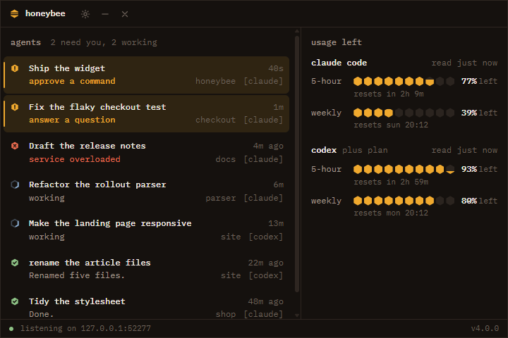

# honeybee

A small desktop widget for people who run coding agents. It shows what each **Claude Code** and **Codex** session is doing, tells you the moment one finishes or needs you, and shows how much of your usage limits is left.



- **Agents**: every session with its state (working, needs you, done, stopped, failed), with what it's waiting for: *approve a command*, *answer a question*, *review the plan*.
- **Alerts**: a desktop notification the moment a session needs you or finishes.
- **Usage**: your 5-hour and weekly limits for Claude and Codex, drawn as a honeycomb that empties as you use it, with reset times.
- **Out of the way**: pressing ✕ turns the window into a bee that flies home to a small hexagon, the hive, which floats on top. It turns honey-coloured when something needs you. Click it and the bee flies back out as the window opens; drag it anywhere. Quit from the tray icon or the hive's right-click menu.
- **Fits anywhere**: from a 300 px sliver to a wide two-column view, with a divider you can drag. Light and dark themes follow your system.
- **Your text size**: Ctrl + and Ctrl − (Cmd on a Mac), Ctrl and the mouse wheel, or settings → text size.

Works on Windows, macOS and Linux. Unofficial, and not affiliated with Anthropic or OpenAI.

## Download

**[Latest release →](https://github.com/banuca/honeybee/releases/latest)**

| System | File |
| --- | --- |
| Windows 10/11 (x64) | `honeybee-…-win-x64-setup.exe`, or `…-portable.exe` with no install |
| macOS, Apple silicon | `honeybee-…-mac-arm64.dmg` |
| macOS, Intel | `honeybee-…-mac-x64.dmg` |
| Linux (x64 or arm64) | `honeybee-…-linux-….AppImage` or `.deb` |

The builds aren't code-signed (that needs a paid certificate), so the first launch asks for a click:

- **Windows**: SmartScreen says "Windows protected your PC". Choose **More info → Run anyway**.
- **macOS**: right-click the app and choose **Open**. On macOS 15 and later, open **System Settings → Privacy & Security** and click **Open Anyway**.
- **Linux**: make the AppImage executable (`chmod +x honeybee-*.AppImage`), or install the deb with `sudo apt install ./honeybee-*.deb`.

## Connect your agents

Open settings (the gear) and press **connect** for each agent. honeybee shows exactly what it will change before it does it.

**Claude Code**: honeybee adds hooks and a status line to `~/.claude/settings.json`. Your file is copied to `settings.json.before-honeybee` first, and every hook you already have stays as it is. Changes take effect straight away, in the terminal and in the VS Code extension.

**Codex**: honeybee adds hooks to `~/.codex/hooks.json` (backed up the same way). Codex runs new hooks only after you trust them, so open Codex once, type `/hooks`, and trust honeybee's seven hooks. Even before you do, honeybee shows your Codex sessions and limits from Codex's own session logs. You just won't get the "needs your approval" alert until the hooks are trusted.

**disconnect** removes only honeybee's entries. If honeybee replaced a status line you had, disconnecting puts yours back.

## Where the numbers come from

honeybee never signs in to anything and never asks for a password or token.

- **Claude**: Claude Code passes its own 5-hour and weekly readings to the status line command, and honeybee's status line forwards them. **Claude Code only does this in terminal sessions, not in the VS Code extension's panel**, so the numbers update whenever you use Claude Code in a terminal. To keep them current while you work in VS Code, turn on the extension's **Use Terminal** setting (`claudeCode.useTerminal`): Claude Code then runs in VS Code's terminal and every reply updates honeybee. When the reading is old, honeybee says so. Only Pro and Max plans have these limits, and Claude Code doesn't report per-model limits, such as the weekly Fable limit, to other apps.
- **Codex**: Codex writes its rate limits into its session logs (`~/.codex/sessions`) on every turn, and honeybee reads the latest one.

A reading is always a snapshot. honeybee shows when each one was taken, and once a window's reset time passes it shows that window as reset instead of keeping the old number.

honeybee doesn't sign in to claude.ai, because Anthropic's terms don't allow third-party apps to offer Claude sign-in or to store Claude session tokens ([Claude Code legal and compliance](https://code.claude.com/docs/en/legal-and-compliance)). That's why v4 dropped the sign-in that AI Usage Monitor v3 had.

## Privacy and security

- Everything stays on your computer. The only network request honeybee makes on its own is a check of GitHub for a newer release, at start and then every 12 hours. It only tells you; it never downloads anything.
- Agents report to honeybee at `127.0.0.1:47621`, on this computer only. Every request must carry a random token that honeybee created, and requests from web pages are refused.
- honeybee's replies to hooks are always empty, so it can't approve, block or change anything an agent does.
- It reads your agents' local files (transcripts and session logs) for session names and limits. It writes only its own hook entries, and only after you press connect.

## Good to know

- **If honeybee isn't running**, Claude Code records a harmless "hook error" for each event. It shows only in Claude Code's transcript view (Ctrl+O) and never stops your work. The status line is also empty while honeybee is closed. Codex stays silent. If you stop using honeybee, press **disconnect** first.
- **A custom status line in Claude Code** replaces some of the footer hints in the terminal. If you already had your own, honeybee asks before replacing it and restores it when you disconnect.
- **Sessions that were already open** when you connected show up after their next prompt.
- **Linux tray**: stock GNOME hides tray icons unless you add the AppIndicator extension. The bubble works either way.
- **The bee** flies on Windows and macOS. On Linux the window folds and opens straight away, as some desktops don't let apps place their windows.
- **Ubuntu 24.04 and later**: if the AppImage won't start, it's Ubuntu's restriction on Electron's sandbox. Install the `.deb` instead, which sets the sandbox up properly, or start the AppImage with `--no-sandbox`.

## Build from source

You need Node.js 22.12 or later.

```bash
git clone https://github.com/banuca/honeybee.git
cd honeybee
npm ci
npm start              # run it
npm test               # unit tests
npm run test:electron  # end-to-end test in a real Electron window
npm run build:win      # or build:mac / build:linux
```

`npm run icons` regenerates every icon from the SVGs in `scripts/make-icons.js`.

## Coming from AI Usage Monitor v3

honeybee is v4 of the same project, renamed and rebuilt. Sign-ins and manual tracking are gone, so your saved v3 accounts aren't carried over. Agents are new. v3 stays available from its [releases](https://github.com/banuca/honeybee/releases/tag/v3.0.2).

## Help

Something wrong? [Open an issue](https://github.com/banuca/honeybee/issues) with your OS, the agent and its version, and what you expected to see.

## Credits

honeybee began as a fork of the original Claude Usage Widget by Slavomir Durej, with thanks to [@cwil2072](https://github.com/cwil2072), [@dion-jy](https://github.com/dion-jy), [@goooseman](https://github.com/goooseman) and [@sergkuzn](https://github.com/sergkuzn). Its look is inspired by [opencode](https://opencode.ai). It uses IBM Plex Mono under the SIL Open Font License.

## License

[MIT](LICENSE)
